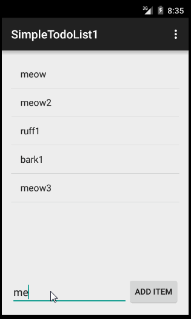

# SimpleTodoList
Simple todo List

This is the README.md file for the SimpleTodoList project.

This program enables a user to:
 1. add items to a list
 2. edit items in the list with a short click
 3. delete items in the list with a long click

A GIF video (made with **LiceCap**) is shown below with the user stories:

https://github.com/marknic8github1/SimpleTodoList/blob/master/SimpleTodoList1video2.gif

There are some suggested added capabilities that can be added to make this app more robust.  
Added settings menu items to both screens.  
Attempting to add a delete confirmation dialog box.  
Added the ability to change the background color of each of the two layouts.

Last README.md update on April 10, 2015 at 4:19PM Pacific time.  
Have a great *Day*!  

Mark
